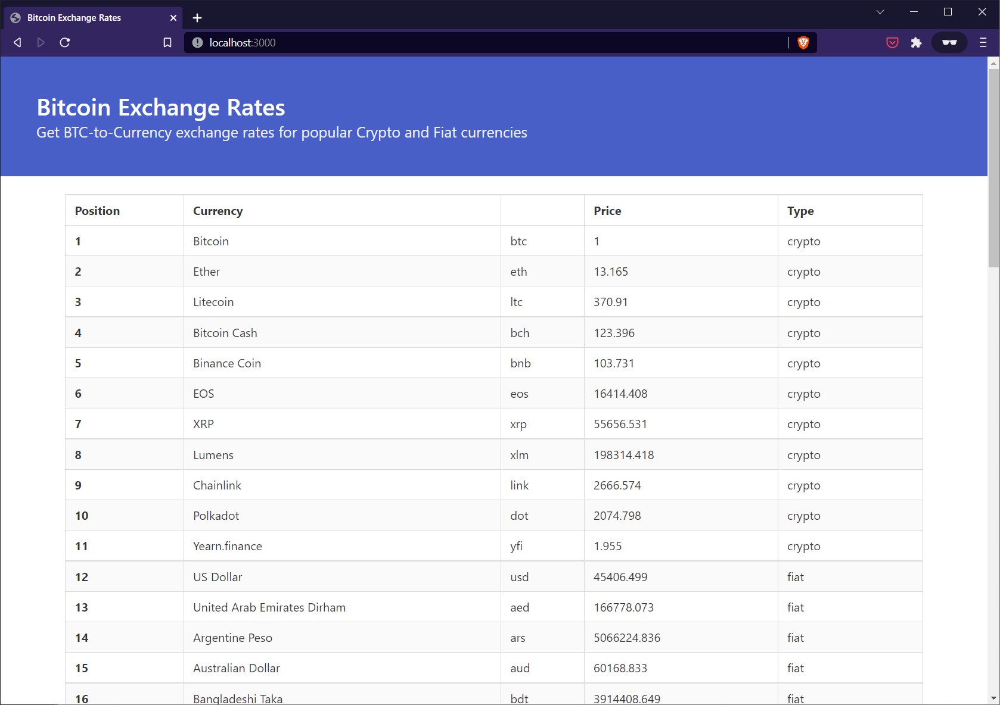

# Bitcoin Exchange Rates

Get BTC-to-Currency exchange rates for popular Crypto and Fiat currencies.

**Tutorial**: []().



## 🟢 Prerequisites

You must have Node.js and `npm` installed on your machine. This project was built against the following versions:

- Node.js v16.14.2.
- npm v8.5.0.

## 📦 Getting started

- Clone this repo to your machine:

```shell
git clone https://github.com/betterstack-community/btc-exchange-rates
```

- `cd` into the project folder and run `npm install` to download dependencies.
- Execute the command below to start the development server:

```shell
npm run dev
```

- Visit http://localhost:3000 in your browser.

## ⚖ License

The code used in this project and in the linked tutorial are licensed under the [Apache License, Version 2.0](LICENSE).
